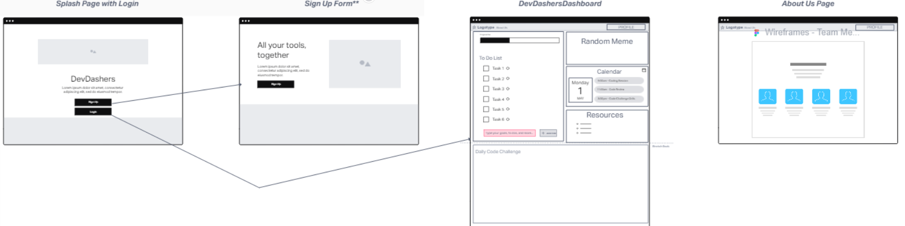
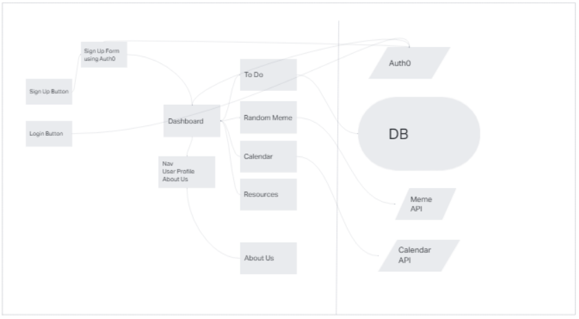
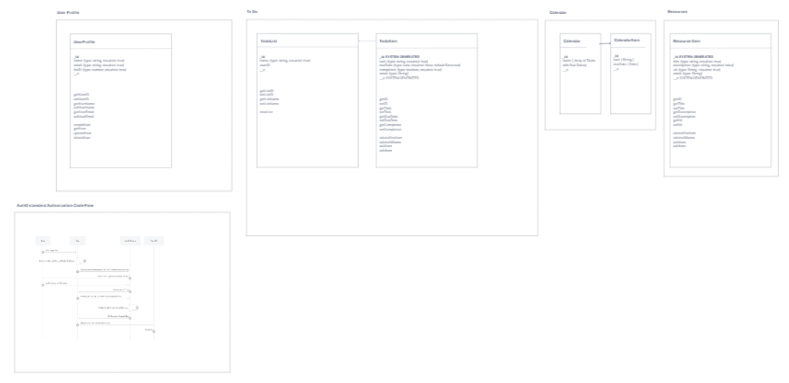

# DevDashers Dashboard - Front End

 DevDashers Dashboard - Front End is a web application using React, Bootstrap/MaterialUI. Create, Update, and Delete To-Do Lists, Generate Random Meme images, gives users a random code challenge each day. This Repo will be the backend of an application, creating calls to various APIs and MongoDB Cloud.

**Version**:

1.1.0 - First full functionality launch!  
1.0.0 - Repo Setup and Front end Connected to Backend API

## Getting Started

In order to get this code working you need to fill in the `.env` file after cloning the whole repo. You also would need a link to a MongoDB database.

## Architecture

This application uses `React`, `Axios`, `React-Bootstrap`, and `React-Bootstrap-Icons`.

## Change Log

5-4-2023 ~ ALL THE STYLING!!  
5-3-2023 ~ Full MVP functionality!  
5-2-2023 ~ Memes became cute things & ToDo list + resources CRUD functional!  
5-1-2023 ~ Connect Front End & Back End  
4-29-2023 ~ Create Repo

## Credit and Collaborations

- [Donna Ada](https://github.com/donnaada)  
- [Kaeden O'Meara](https://github.com/KaedenOC)  
- [Heather Holcomb](https://github.com/holcombheather)  
- [Michael "Ike" Steoger](https://github.com/IkeSteoger)

## [Back End Repo](https://github.com/DevDashers/dashboard-backend)

## WireFrame

## Domain Modeling

## Data Schema

